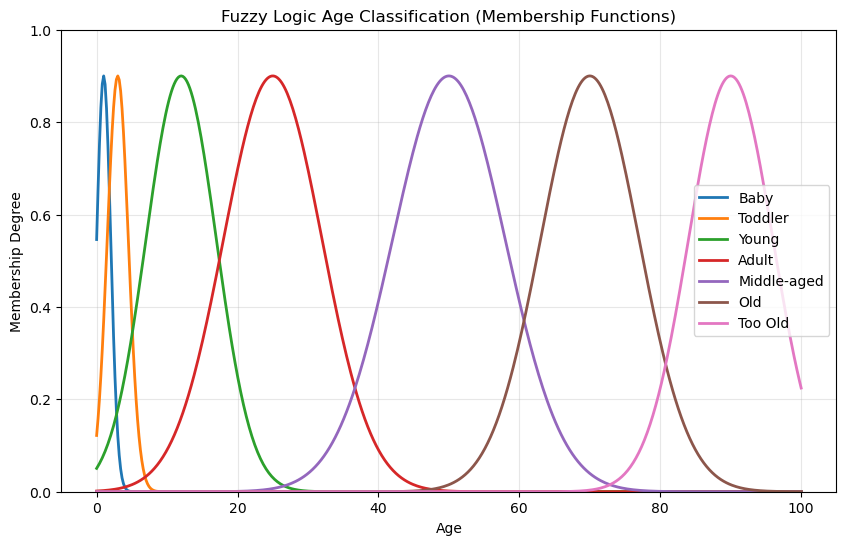
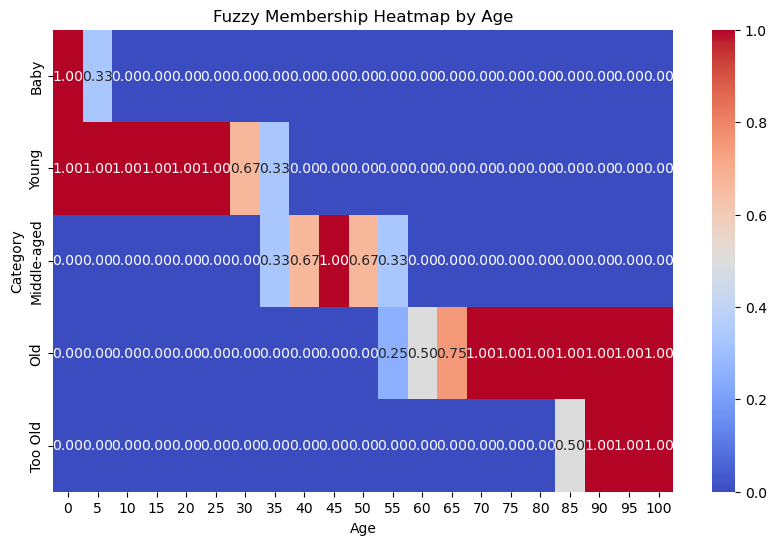

# 🧠 Fuzzy Logic Age Classification

A **fuzzy logic-based age classification system** that categorizes a person's life stage into one of **seven groups** — `Baby`, `Toddler`, `Young`, `Adult`, `Middle-aged`, `Old`, and `Too Old` — with **smooth, overlapping membership functions**.

Unlike traditional hard classification, fuzzy logic allows **partial membership** in multiple categories, enabling more realistic and human-like classification.

---

## 📌 Features

- **Gaussian Membership Functions** with peak < `1.0` to reflect real-world uncertainty
- **Seven Life Stages** with smooth transitions:
  - Baby
  - Toddler
  - Young
  - Adult
  - Middle-aged
  - Old
  - Too Old
- **No Crisp Boundaries** — age groups overlap naturally
- **Visualizations**:
  - Membership Function Graph
  - Heatmap for a given age
- **Human-Friendly Output** — returns sentences like:
  > `"The person is a Middle-aged"`

---

## 🧮 Fuzzy Logic Theory

### 1. Membership Functions

We use **Gaussian functions** for each life stage:

\[
\mu_{category}(age) = peak \times e^{-\frac{(age - center)^2}{2\sigma^2}}
\]

Where:
- **`peak`** = `0.9` (no set reaches certainty)
- **`center`** = age where the category peaks
- **`σ`** = spread (controls category width)

| Category     | Center | Spread (σ) |
|--------------|--------|------------|
| Baby         | 1      | 1.0        |
| Toddler      | 3      | 1.5        |
| Young        | 12     | 5.0        |
| Adult        | 25     | 7.0        |
| Middle-aged  | 50     | 8.0        |
| Old          | 70     | 7.0        |
| Too Old      | 90     | 6.0        |

---

### 2. Overlapping Sets

Life stages **overlap** to ensure smooth transitions:

Example: **Age = 20**
- μ(Young) = 0.50
- μ(Adult) = 0.60  
→ Slightly more "Adult" than "Young", but both apply.

---

### 3. Category Selection

We classify using:

\[
Category = \arg\max_{c} \mu_{c}(age)
\]

Then return:
> `"The person is an Adult"`

---

## 📊 Visualization

### Membership Function Plot

- Each curve overlaps smoothly.
- None of the curves reach membership = 1.

### Heatmap Example

---
